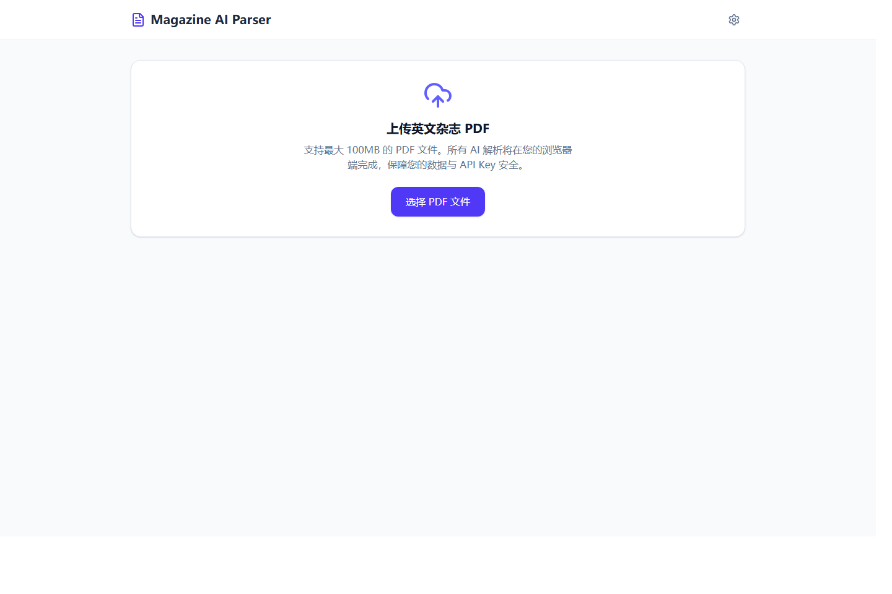

# Magazine AI Parser

一个本地运行的英文杂志 PDF 解析工具。

[](https://nodejs.org/)
[](https://react.dev/)
[](https://www.typescriptlang.org/)
[](./LICENSE)



它可以完成这些事情：

- 上传英文杂志 PDF
- 提取 PDF 文本内容
- 使用 AI 自动识别目录
- 按文章进行摘要、翻译、词汇提取和结构分析
- 将已解析内容导出为 Markdown

项目适合这些场景：

- 阅读英文杂志
- 批量整理杂志文章
- 做中英对照学习材料
- 将杂志内容转成 Markdown 继续编辑

## 快速开始

```bash
npm install
copy .env.example .env.local
npm run dev
```

然后打开 [http://localhost:3000](http://localhost:3000)。

## 功能特性

- 前后端一体化，本地直接运行
- 支持 100MB 以内 PDF 上传
- 支持 Gemini 和 DeepSeek 两种模型
- 支持在页面内保存 API 配置
- 支持极速模式，减少目录提取和文章解析时间
- 支持按文章选择并导出 Markdown

## 技术栈

- React 19
- TypeScript
- Vite
- Express
- Multer
- `pdf-parse`
- Gemini API / DeepSeek API

## 项目结构

```text
.
├─ src/                # 前端页面
├─ server.ts           # 本地服务端
├─ package.json        # 脚本和依赖
├─ .env.example        # 环境变量模板
└─ README.md
```

## 本地运行

### 1. 环境要求

- Node.js 22 或更高版本
- npm 10 或更高版本

### 2. 安装依赖

```bash
npm install
```

### 3. 配置环境变量

复制模板文件：

```bash
copy .env.example .env.local
```

按需填写 `.env.local`：

```env
PORT=3000
VITE_AI_PROVIDER=gemini
VITE_GEMINI_API_KEY=your_api_key
VITE_GEMINI_MODEL=gemini-3-flash-preview
VITE_DEEPSEEK_API_KEY=
VITE_DEEPSEEK_MODEL=deepseek-chat
VITE_GLOBAL_PROMPT=
```

说明：

- 至少配置一组可用的模型 API Key
- 如果不想写入 `.env.local`，也可以启动后在页面右上角的“设置”中填写

### 4. 启动项目

开发模式：

```bash
npm run dev
```

启动后访问：

[http://localhost:3000](http://localhost:3000)

### 5. 构建产物

如果你只需要构建前端静态资源：

```bash
npm run build
```

构建结果会输出到 `dist/` 目录。

## 使用说明

1. 启动项目并打开网页
2. 点击右上角设置按钮，选择模型提供商并填写 API Key
3. 上传英文杂志 PDF
4. 等待系统提取 PDF 文本和目录
5. 对目录中的文章逐篇点击“开始解析”
6. 勾选需要导出的文章
7. 点击“导出已选文章”生成 Markdown 文件

## 常用命令

```bash
npm run dev
npm run start
npm run build
npm run lint
```

说明：

- `npm run dev`：开发模式运行
- `npm run start`：直接启动服务端入口
- `npm run build`：构建前端静态资源
- `npm run lint`：执行 TypeScript 类型检查

## 配置项

| 变量名                     | 说明               | 默认值                      |
| ----------------------- | ---------------- | ------------------------ |
| `PORT`                  | 本地服务端口           | `3000`                   |
| `VITE_AI_PROVIDER`      | 默认模型提供商          | `gemini`                 |
| `VITE_GEMINI_API_KEY`   | Gemini API Key   | 空                        |
| `VITE_GEMINI_MODEL`     | Gemini 模型名       | `gemini-3-flash-preview` |
| `VITE_DEEPSEEK_API_KEY` | DeepSeek API Key | 空                        |
| `VITE_DEEPSEEK_MODEL`   | DeepSeek 模型名     | `deepseek-chat`          |
| `VITE_GLOBAL_PROMPT`    | 自定义全局提示词         | 空                        |

## 工作流程

1. 前端将 PDF 分片上传到本地服务端
2. 服务端使用 `pdf-parse` 提取页面文本
3. 前端调用 AI 提取目录
4. 用户选择文章后，前端调用 AI 解析文章
5. 前端将结果整理后导出为 Markdown

## 隐私说明

请注意以下几点：

- PDF 文件会先上传到你本地运行的服务端处理，不会默认保存到数据库
- 文章文本会发送给你选择的第三方模型接口，例如 Gemini 或 DeepSeek
- 你在页面中输入的 API Key 会保存在浏览器 `localStorage`
- `.env.local` 已被 `.gitignore` 忽略，不会默认提交到仓库

如果你处理的是敏感文档，建议：

- 使用专门的低权限 API Key
- 不要在公共或共用浏览器环境中保存密钥
- 在使用结束后清理浏览器本地存储

## 已知限制

- 扫描版 PDF 如果没有可提取文本，无法直接解析
- AI 提取目录和文章解析速度取决于模型响应速度和文本长度
- 超长文章在极速模式下会进行内容裁剪，以换取更快的响应

## 后续可扩展方向

- 本地规则优先提取目录，进一步减少 AI 调用
- 文章分段并发解析
- OCR 支持扫描版 PDF
- 导出为多文件 Markdown 或 Obsidian 结构

## License

[MIT](./LICENSE)
